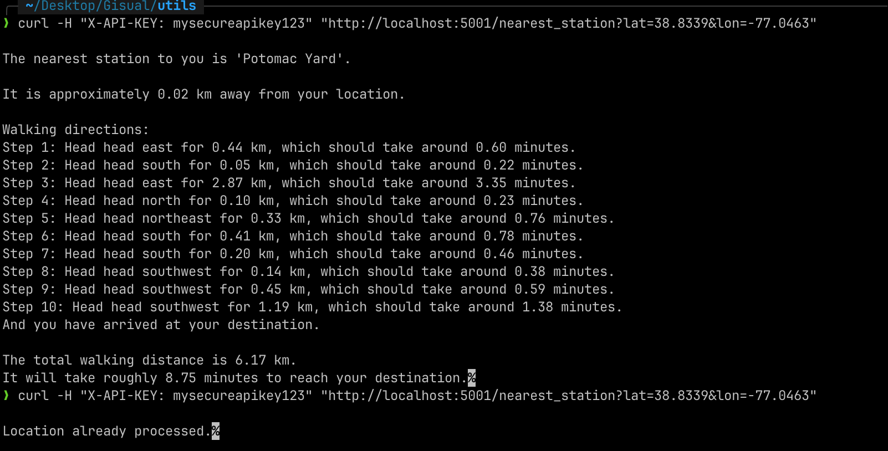
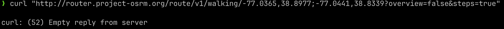

# Gisual Coding Challenge

First of all, thank you for this opportunity. This challege was a great learning experience for me, and possibly one of the more interesting ones I have involved myself with recently.

## To Note - 
1. Although I have written the dockerfile and k8 config files, I was not able to get it working, as I was having issues with the installation of GDAL package on the docker image. This is what I was trying to get working for about a day.
2. Create an env var or a dotenv file to create an API_KEY.
3. After the second step, in the root dir, just run `python main.py` and the project should be up and running.
4. Request Example - `curl -H "X-API-KEY: enterapikeyhere" "http://localhost:5001/nearest_station?lat=38.8339&lon=-77.0411"`

## Features - 

1. `find_nearest_station_with_directions` in `nearest_station_with_dir` file is the function that returns the geojson of the nearest station, with walking directions.
2. The API `/nearest-station` in `main.py` is the api that exposes the above function.
3. I have used Redis to keep track of locations, and if the user attempts to send a request with the same location, they are notified that the location was already processed.
4. To the API cost effective, again the use of a Redis cache helps, and immediately mentions to the user the location was processed, without processing it again. 
5. The API return looks like this - 
6. To make accessable to millions of users, I made sure to make functions asynchronous, and wrote kubernetes config to make it horizontally scalable.
7. I created an api key to restrict random access, rate_limt to prevent DOS attacks and CORS middleware to make it more secure. 
8. I have incorporated the dc metro, and the api is backward compatible, as I have maintained the structure of the api before integration.
9. I created a dockerfile, and my plan was to push to dockerhub. Then pull it into the `deployment.yaml`, and then deploy it in kubernetes, as it offers load balancing and auto scaling. I was not able to get this running unfortunately, as I mentioned before. I will be working on this even after this submission.

FYI I noticed since 4am EST, OSRM is not responding to walking requests -  This was a test I did directly sending a request to the server, and I got a null response.

Thank you!
